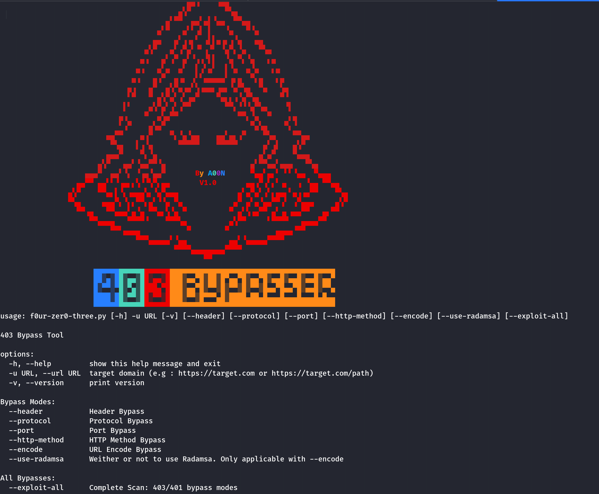

# F0UR-ZER0-THREE BYPASSER BY A00N

## -> Introduction

**F0UR-ZER0-THREE** : Tool to bypass 403/401 pages. this tool use multiple methods with an auto payload generator using [radamsa](https://gitlab.com/akihe/radamsa).

## -> Preview


https://github.com/user-attachments/assets/bb4cc483-579f-46d8-bde3-623891aa4daf


## -> The Advantage of the tool

**The primary strength of this tool lies in its ability to generate random payloads using [Radamsa](https://gitlab.com/akihe/radamsa). This feature offers a wide array of unpredictable and varied payloads, enhancing its effectiveness in bypassing 403/401 Forbidden errors.**

## -> Help

```bash
python3 f0ur-zer0-three.py -h
```



## -> Usage

- Scan with specific payloads:
  - `--header` Support HEADER based bypasses/payloads
    ```bash
    python3 f0ur-zer0-three.py -u https://target.com/anything --header
    ```
  - `--protocol` Support PROTOCOL based bypasses/payloads
    ```bash
    python3 f0ur-zer0-three.py -u https://target.com/anything --protocol
    ```
  - `--port` Support PORT based bypasses/payloads
    ```bash
    python3 f0ur-zer0-three.py -u https://target.com/anything --port
    ```
  - `--http-method` Support HTTP Method based bypasses/payloads
    ```bash
    python3 f0ur-zer0-three.py -u https://target.com/anything --http-method
    ```
  - `--encode` Support URL Encoded bypasses/payloads
    ```bash
    python3 f0ur-zer0-three.py -u https://target.com/anything --encode
    ```
- Complete Scan **includes all exploits/payloads** for an endpoint [ --exploit-all ]

```bash
python3 f0ur-zer0-three.py -u https://target.com/anything --exploit-all
```

## -> Installation
First install radamsa from [here](https://gitlab.com/akihe/radamsa).
Then install the tool.
```bash
git clone https://github.com/Ay0ubN0uri/FOUR-ZERO-THREE.git
cd FOUR-ZERO-THREE
python3 -m venv .venv
source .venv/bin/activate
# or .venv/bin/activate.ps1 for windows
pip install -r requirements.txt
python3 f0ur-zer0-three.py -h
```
